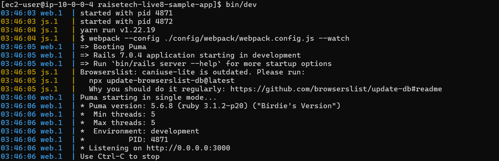
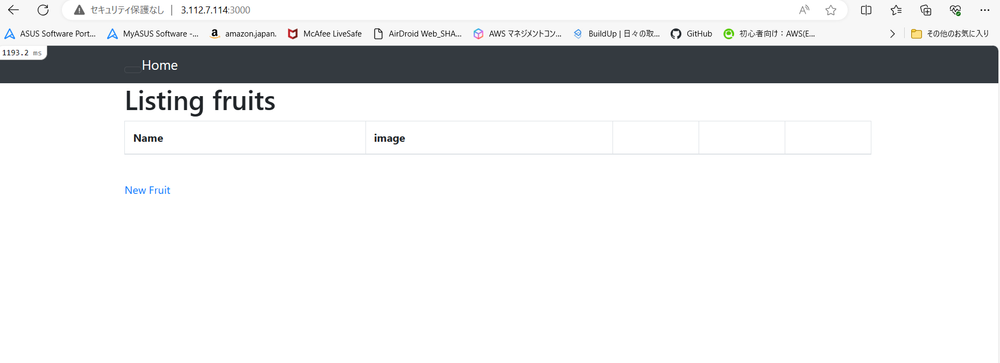
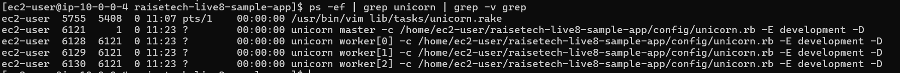
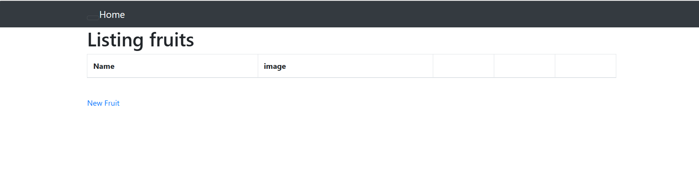
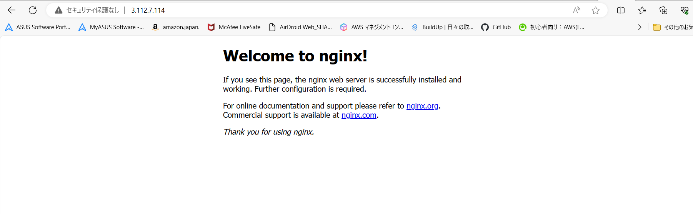
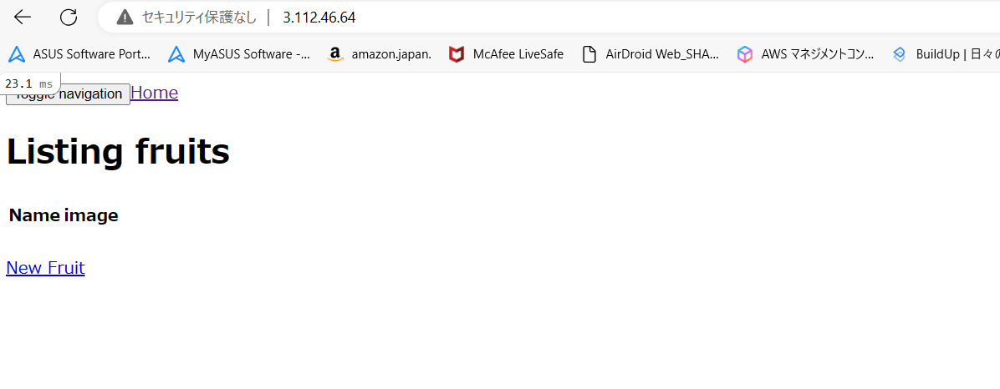

# lecture5課題
- lecture5の課題途中ですが、作業手順と表示されている画像があっているか確認をお願いしたいです。
- やったこと
 ruby・bundler・rails・node・yarnをインストール
 組み込みサーバーでの動作確認
 unicornでの動作確認
 Nginx動作確認
 Nginxとunicornを連携しての動作確認

作業した手順は下記に記します。
だいぶ長くなってしまいましたが、よろしくお願いいたします。

# EC2上にサンプルアプリケーションをデプロイして動作確認
- プラグインの導入
```
$sudo yum install git make gcc-c++ patch openssl-devel libyaml-devel libffi-devel libicu-devel libxml2 libxslt libxml2-devel libxslt-devel zlib-devel readline-devel ImageMagick ImageMagick-devel epel-release
```
- rbenvをインストール
```
$git clone https://github.com/sstephenson/rbenv.git ~/.rbenv
$ echo 'export PATH="$HOME/.rbenv/bin:$PATH"' >> ~/.bash_profile
$ echo 'eval "$(rbenv init -)"' >> ~/.bash_profile
$ source ~/.bash_profile
```
- ruby-buildをインストール
```
$ git clone https://github.com/sstephenson/ruby-build.git ~/.rbenv/plugins/ruby-build
$ rbenv rehash
```
- rubyをインストール
```
$ rbenv install -v 3.1.2
$ rbenv global 3.1.2
$ rbenv rehash
$ ruby -v
```
- railsインストール
```
gem install rails -v 7.0.4
```
- bundlerインストール
```
gem install bundler -v 2.3.14
```
- node.jpインストール
```
$curl -o- https://raw.githubusercontent.com/nvm-sh/nvm/v0.39.5/install.sh | bash
$command -v nvm
$source ~/.bash_profile
$command -v nvm
$nvm install v17.9.1
```
- yarn インストール
```
$ npm install -g yarn
```
 バージョンの切り替えたい場合は
```
$yarn set version [バージョンを指定]
```
- サンプルアプリケーションをクローン・ディレクトリに移動
```
$ git clone https://github.com/yuta-ushijima/raisetech-live8-sample-app.git
$ cd raisetech-live8-sample-app
```
- mysqlインストール
```
$ sudo yum remove -y mariadb-*
$ sudo yum install -y --enablerepo=mysql80-community mysql-community-server
$ yum list installed | grep mysql
$ sudo yum install -y --enablerepo=mysql80-community mysql-community-devel
$ systemctl status mysqld.service
```
- mysql2インストール
```
$ gem install mysql2
$ sudo yum install mysql-devel
$ which mysql
$ which my conf
$ ls /etc/
$ cat /etc/my.cnf
```
- database.ymlを編集
```
$ vim config/database.yml
```
下記を入力
```
 default: &default
 adapter: mysql2
 encoding: ut f8mb4
 pool: <%= ENV. fetch ("RAILS_MAX_THREADS") { 5 } %>
 username：設定したユーザ名
 password:設定したパスワード
 host: RDSのエンドポイント
 port: 3306
 timeout: 5000
 ```

- 組み込みサーバーのみの動作確認
```
$ bin/setup
$bin/dev
```
- EC2のインスタンスにポート3000を追加
http://IPアドレス:3000/で動作確認




# unicornでの動作確認
- unicornインストール。vi Gemfileにunicornを追記してから
```
$ bundle install
```
- unicorn設定
```
$vi config/unicorn.rb
```
listenとpidが
```
「/home/{ユーザ名}/{Railsアプリケーション名}/tmp/unicorn.sock」
「/home/{ユーザ名}/{Railsアプリケーション名}/tmp/unicorn.pid」
```
 になっていることを確認。

- Unicorn の起動・停止スクリプトを作成する
ファイルを生成
```
$ rails g task unicorn
$ vi lib/tasks/unicorn.rake
```
下記を入力
```
namespace :unicorn do
  # Tasks
  desc "Start unicorn"
  task(:start) {
    config = Rails.root.join('config', 'unicorn.rb')
    sh "unicorn -c #{config} -E development -D"
  }

  desc "Stop unicorn"
  task(:stop) {
    unicorn_signal :QUIT
  }

  desc "Restart unicorn with USR2"
  task(:restart) {
    unicorn_signal :USR2
  }

  desc "Increment number of worker processes"
  task(:increment) {
    unicorn_signal :TTIN
  }

  desc "Decrement number of worker processes"
  task(:decrement) {
    unicorn_signal :TTOU
  }

  desc "Unicorn pstree (depends on pstree command)"
  task(:pstree) do
    sh "pstree '#{unicorn_pid}'"
  end

  # Helpers
  def unicorn_signal signal
    Process.kill signal, unicorn_pid
  end

  def unicorn_pid
    begin
      File.read("/home/ec2-user/raisetech-live8-sample-app/unicorn.pid").to_i
    rescue Errno::ENOENT
      raise "Unicorn does not seem to be running"
    end
  end

end
```

def unicorn_pid の File.read の引数のパスは /home/{ユーザ名}/{Railsアプリケーション名}/tmp/unicorn.pidにする。


- unicorn起動
```
$ rake unicorn:start
```
Unicorn が起動しているかどうかを確認するには以下のコマンドを実行
```
$ ps -ef | grep unicorn | grep -v grep
```
Unicorn を停止するには以下のコマンドを実行
```
$ rake unicorn:stop
```



# Nginx動作確認
- Nginxインストールして起動
```
$sudo amazon-linux-extras enable nginx1
$sudo yum -y install nginx
$ nginx -v
$sudo systemctl start nginx.service
$sudo systemctl status nginx.service
```
- Nginx動作確認


# nginxとunicornを連携して動作確認
- Nginxを停止
```
$sudo systemctl stop nginx
```
- Nginxの設定ファイルを作成し編集
```
$ sudo vi /etc/nginx/conf.d/raisetech-live8-sample-app.conf
```
下記を作成したファイルに入力
```
upstream unicorn {
  server unix:/home/ec2-user/raisetech-live8-sample-app/unicorn.sock;
}

server {
  listen 80 default_server;
  server_name パブリック IPv4 アドレス;

  access_log /var/log/nginx/sample_access.log;
  error_log /var/log/nginx/sample_error.log;

  root /home/vagrant/projects/unicorn_sample;

  client_max_body_size 100m;
  error_page 404 /404.html;
  error_page 500 502 503 504 /500.html;
  try_files $uri/index.html $uri @unicorn;

  location @unicorn {
    proxy_set_header X-Real-IP $remote_addr;
    proxy_set_header X-Forwarded-For $proxy_add_x_forwarded_for;
    proxy_set_header Host $http_host;
    proxy_pass http://unicorn;
  }
}
 ```

- Nginxを起動
```
$ sudo systemctl start nginx
```
Nginxが起動しているかどうか確認
```
$ systemctl status nginx
```

- Nginxとunicornを使用しての動作確認
アクセス
```
http://[ドメイン名]/
```
]