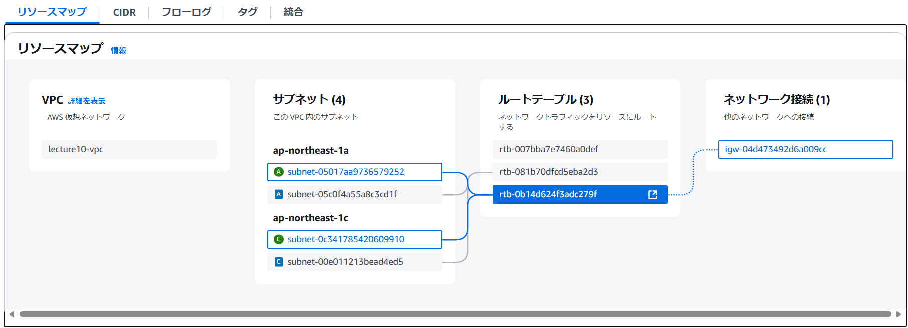
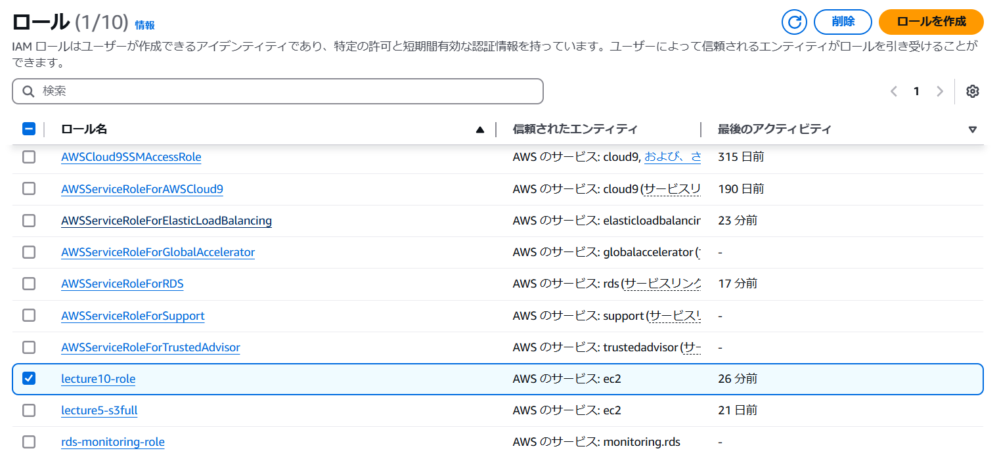

# 第10回課題

## 目次
 1. テンプレート
 1. 環境が自動で構築されているか確認
 1. 感想

## テンプレート
[network template](lecture10/lecture10_lecture10.yaml)
[application template](lecture10/application_lecture10.yaml)

## 環境が自動で構築されているかそれぞれ確認

### stack

### VPV,subnet,RouteTable,internet gateway

### IAMrole

### security group

### EC2

### RDS

### ALB

### subnet group

### target group

### S3

## 感想
- 個人的にすごくおもしろい課題だった。このサブネットIDはこのサブネットを指定したり、自分でパラメータを作成してそれを活用したりなど、パズル感覚で作成することに面白さを感じた。

