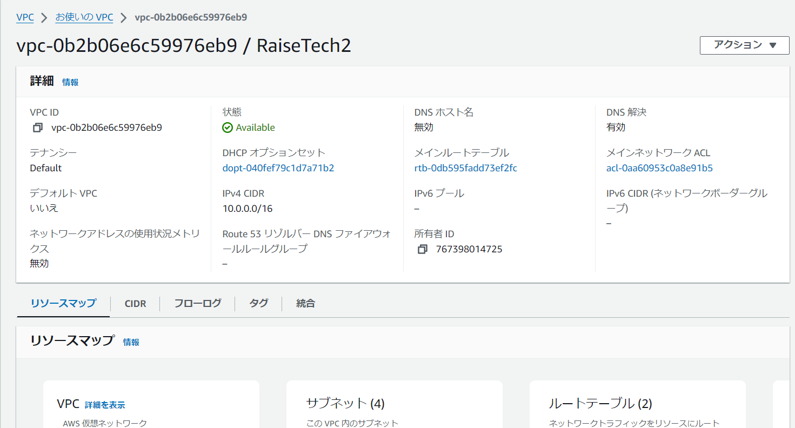
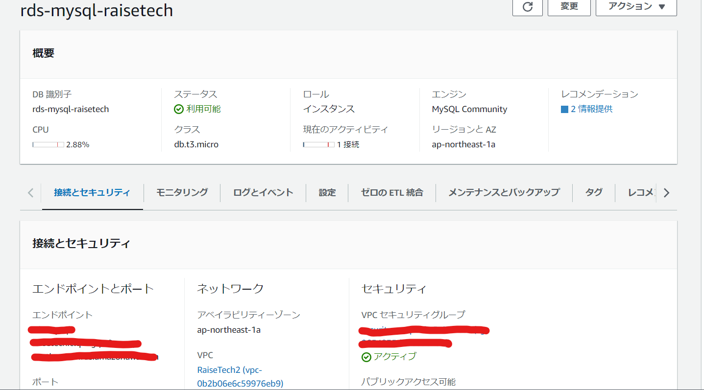
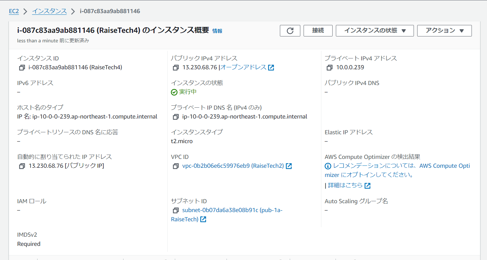
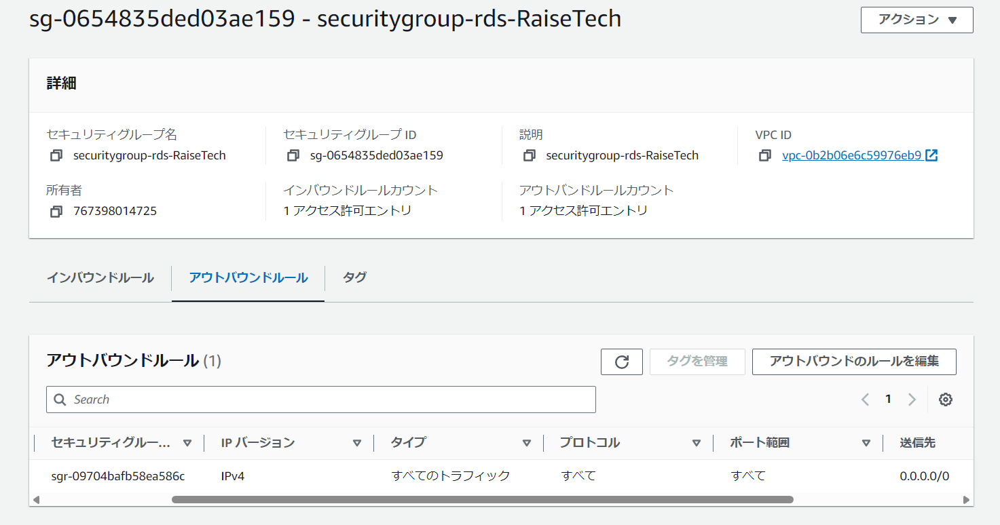
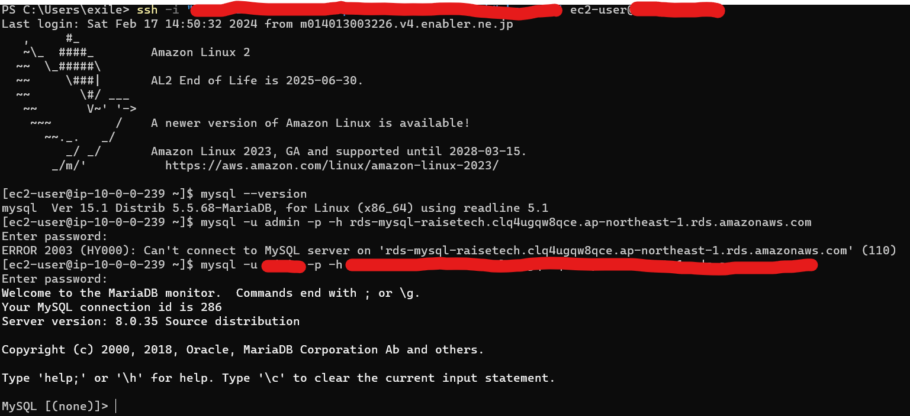

# lecture4課題報告

- VPC作成
<<<<<<< HEAD

- EC2構築

- RDS構築

- EC2からRDSへ接続

=======

- EC2構築

- RDS構築

- EC2からRDSへ接続

>>>>>>> main

# lecture4感想
- EC2からRDSへ接続できず躓いた。最初から(VPC作成から)作ってみたりしたけど、できなくて困っていた。原因は、セキュリティのインバウンド・アウトバウンドの設定に問題があったため接続できなかった。インバウンド・アウトバウンドも勉強不足と感じたので、理解を深めていこうと思った。
- MySQLをインストールをインストールできず躓いた。最初から(VPC作成から)最初から(VPC作成から)作ったら解決したから、原因はわからず終わった。
