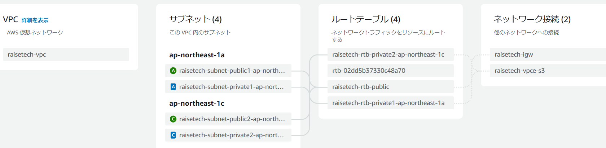
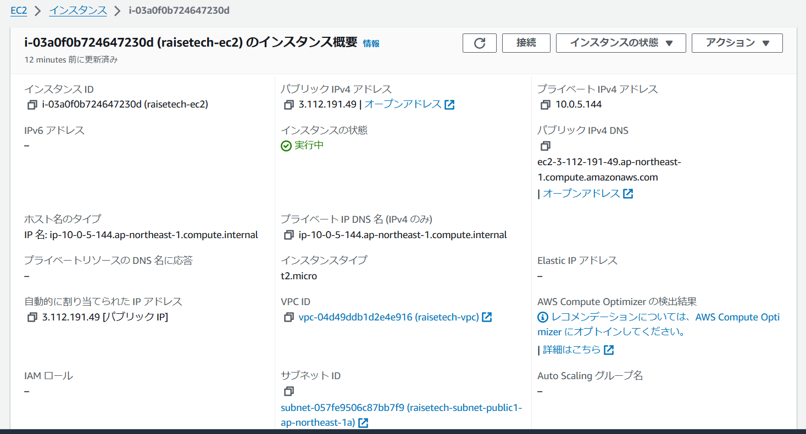

# **第4回課題やり直し**

## **目次**
1. VPC作成
1. EC2作成、接続
1. RDS作成、接続

## **VPC作成**

- 手順
1. 作成するリソース　「VPCなど」
1. 名前をつける。IPv4 CIDRブロック、IPv6 CIDRブロック、テナンシーは変更なし
1. AZの数、パブリックサブネットとプライベートサブネットの数は「2」
   1にするか迷ったが、授業では数はそのままでよいとのことなので、デフォルトの2で作成することにした
1. NATゲートウェイは「なし」
1. VPCエンドポイントは「S3ゲートウェイ」を選択
1. DNSオプションは「DNSホスト名を有効化」「DNS解決を有効化」にチェック

## **VPCリソースマップ**

## **EC2作成**

- 手順
1. 名前をつける
1. AMI「Amazon Linux 2 with.NET6,PowerShell,Mono,and MATE Desktop Environment」を選択
1. インスタンスタイプ「t2.micro」
1. キーペア選択　選択肢がない場合新しく作成
1. ネットワーク設定
 - ネットワーク「作成したVPC」
 - サブネットは「private subnetを選択」今回は1cのサブネットを選択
 - パブリックIPの自動割り当て「有効化」
 - セキュリティグループを選択　
6. インスタンス作成でEC2作成

## **EC2セキュリティ**

## **EC2接続**

- 手順
1. PowerSell起動
1. sshで接続
  「ssh -i "作成したキーペアのパス" ec2-user@作成したEC2のパブリックIPv4アドレス」

## **RDS作成**

- 手順
1. サブネットグループを作成
1. データベース作成方法を選択「標準作成」
1. エンジンのオプション「MySQL」
1. テンプレート「無料利用枠」
1. 設定
 - DBインスタンス識別子（名前）をつける
 - マスターユーザー名「admin」
 - 認証情報管理「セルフマネージド」
 - パスワードを入力　Password strengthがvery strongになるように
6. インスタンスの設定「db.t3.micro」
6. ストレージは変更なし
6. 接続
 - コンピューティングリソース「EC2コンピューティングリソースに接続しない」
 - 作成したVPCを選択
 - 作成したサブネットグループを選択
 - パブリックアクセス「なし」
 - VPCセキュリティグループ「事前に作成したRDSに使用するセキュリティグループを選択」
 - アベイラビリティーゾーン「ap-northeast-1a」
9. データベース認証「パスワード認証」
9. データベースの作成でRDS作成する

## **RDSセキュリティ**

## **RDS接続**
.png)
- 手順
1. EC2を接続してMySQLをインストールする
 - sshを使用してEC2に接続する
 - MySQLコマンドをインストールする
  `sudo yum -y install mysql`
2. EC2からRDSに接続する
 - 下記を入力し、RDSに接続する
  `mysql -h [エンドポイント] -P 3306 -u admin -p`
 - 入力したらマスターパスワードを求められる。RDS作成時に作成したマスターパスワードを入力する
 - 上記のスクリーンショットのように出力されればOK

## **感想**
- 今回は第5回で躓いたため、もう一度第4回から始めてみることにした。
- 今回から、Cloud9を使わずプルリクエストをしてみた（git bash使用）。マークダウンに画像を表示させる方法にてこずりました。
- githubのCode→Add file→Uplode files→自分で作成したlecture4re.pngのファイルをドラッグ＆ドロップしてファイルを追加した→ `git pull origin lecture4re lecture4re`をして差分をなくす
この方法があっているかわかりませんが、この方法で画像を表示させることができた。
- まだ、画像を表示させる原理を理解できていない。
