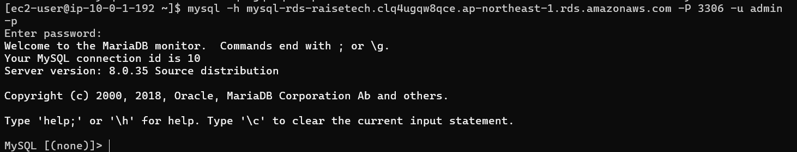

# 第4回課題やり直し

## VPC作成

### VPCリソースマップ

## EC2作成

### EC2セキュリティ

## EC2接続

## RDS作成

### RDSセキュリティ

## RDS接続

## 感想
・今回は第五回で躓いたため、もう一度第四回から始めてみることにした。
・今回から、cloud9を使わずプルリクエストをしてみた（git bash使用）。マークダウンに画像を表示させる方法にてこずりました。
githubのCode→Add file→Uplode files→自分で作成したlecture4re.pngのファイルをドラッグ＆ドロップしてファイルを追加した。
この方法が合っているがわかりませんが、この方法で画像を表示させることができた。
